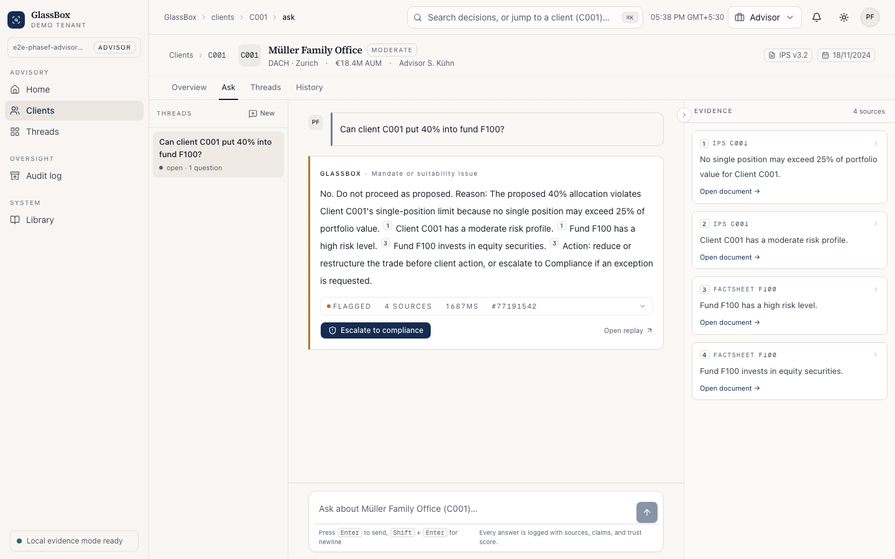
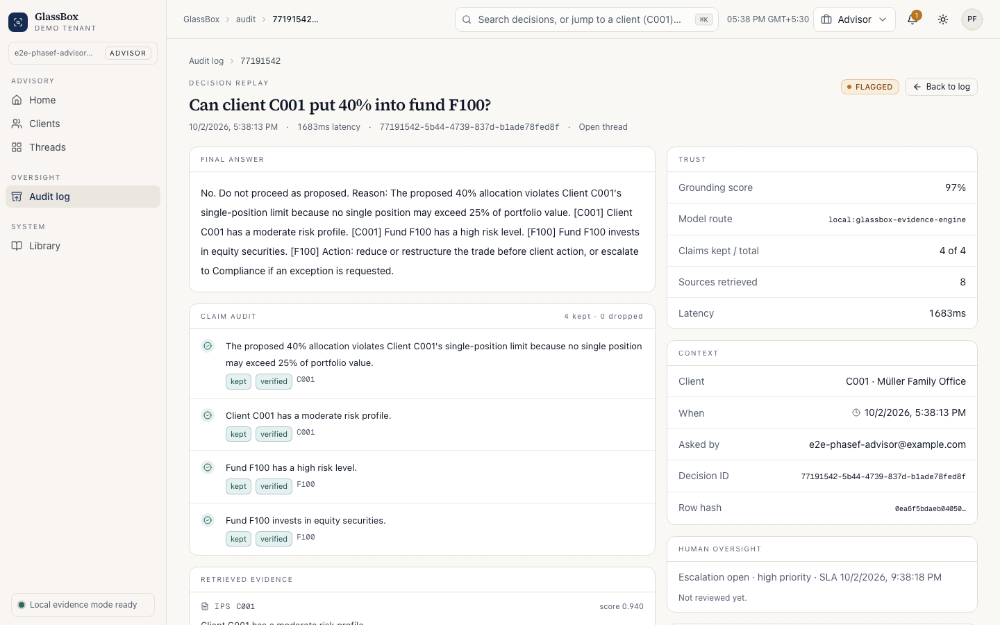
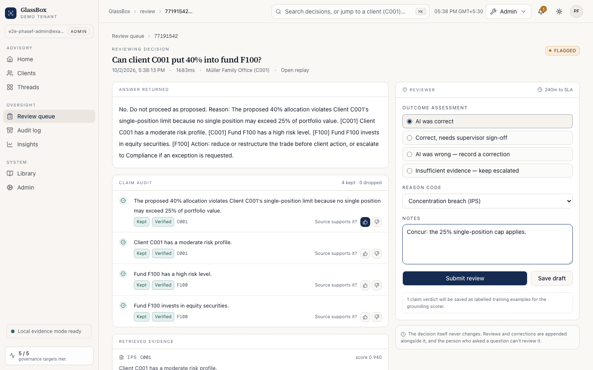
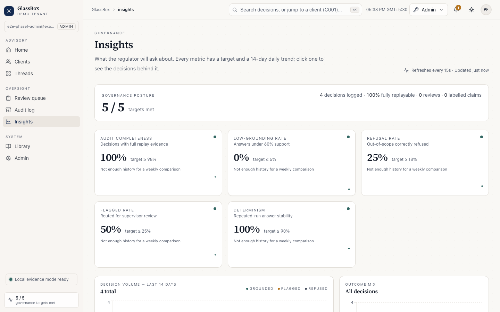
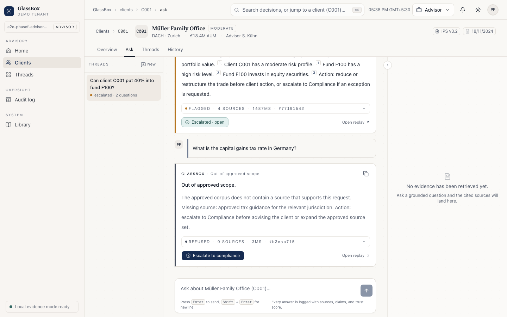

# GlassBox — An Auditable Wealth-Advisory AI Agent

[](https://github.com/yash-vks-chauhan/Glassbox/actions/workflows/ci.yml)
[](https://github.com/yash-vks-chauhan/Glassbox/actions/workflows/deploy.yml)
[](https://glassbox.15-252-203-137.sslip.io/login)
[](LICENSE)

> An AI agent that answers financial advisory & compliance questions **only from cited sources**, **refuses to guess**, **logs every decision for audit**, and **measures its own trustworthiness on a live dashboard.**
>
> Built for the real problem banks (like UBS) have in 2026: not "make a smarter AI" but "make an AI we can actually trust, defend, and deploy."

**[Try the live demo →](https://glassbox.15-252-203-137.sslip.io/login)** One click, no signup.



## Try it

Open the [live demo](https://glassbox.15-252-203-137.sslip.io/login) and
choose a seat:

- **Try as an advisor.** You land on Müller Family Office (C001). Try:
  - *Can client C001 put 40% into fund F100?* GlassBox flags it with the
    25% single-position limit from the client's IPS, and cites each claim.
  - *What about F200?* A follow-up: it answers in context and shows the
    question it actually answered.
  - *What is the capital gains tax rate in Germany?* It refuses, because no
    approved source covers it, and offers escalation to compliance.
- **Try as compliance.** Work the review queue, open a decision's replay,
  label claims, check the audit chain, and export the PDF binder.

The demo workspace is shared, so other visitors see what you ask there.
The demo accounts can't change their sign-in settings or the client list.

## What's in the box

A working multi-tenant web app, not a notebook:

- **Advisor workbench.** Ask about a client in plain language. Every claim is
  cited to an approved document (the client's investment policy statement,
  fund factsheets, regulation) and shown beside the answer. Follow-up
  questions keep the thread's context, and the question the system actually
  answered is shown and logged.
- **Refuses instead of guessing.** Out-of-scope questions get a refusal that
  says what source is missing, plus a one-click escalation to compliance.
- **Audit trail.** Every decision is stored with the passages retrieved, the
  claims kept and dropped, and its trust scores, then chained into a
  tamper-evident hash chain per tenant. The database refuses deletes on the
  audit tables. Filter the log, replay any decision, export CSV or a PDF
  binder.
- **Human oversight.** Escalations carry an SLA. Reviewers work a queue under
  a four-eyes rule (you can't review your own question), label each claim,
  and record corrections alongside the original, never over it. Those labels
  feed the grounding scorer's training data.
- **Governance metrics.** Audit completeness, low-grounding, refusal and
  flagged rates, and determinism, each with a target and a 14-day trend. A
  nightly determinism harness re-asks recent questions and measures drift.
- **Accounts and security.** Workspaces with owner / admin / compliance /
  advisor roles, invitations, TOTP MFA for owners and admins (secrets
  encrypted at rest), rotating refresh tokens with reuse detection, rate
  limits, strict request validation, and prompt-injection containment.
- **No paid model needed.** The default answer path is a local evidence
  engine (retrieval, policy checks, claim verification) that runs on CPU in
  milliseconds. Hosted or self-hosted LLMs can be added, but only after they
  pass the same evaluation gate.

## Run it

**With Docker** (Postgres, the API and the web app):

```bash
BOOTSTRAP_SETUP_KEY=choose-a-long-random-string docker compose up --build
```

Open <http://localhost:3000/setup>, enter that key and create the first owner.
Use workspace ID `demo` to get the four sample clients and their documents.

**Without Docker** (Python 3.12, Node 22):

```bash
python3.12 -m venv .venv
.venv/bin/pip install -r backend/requirements-dev.txt
cp .env.example .env          # then set BOOTSTRAP_SETUP_KEY in it

cd backend && ../.venv/bin/uvicorn app.main:app --reload --port 8000
# in a second terminal:
cd frontend && npm ci && npm run dev
```

Then open <http://localhost:3000/setup> as above. Locally the database is
SQLite (`backend/glassbox_local.db`) unless `DATABASE_URL` points at Postgres;
see [backend/README.md](backend/README.md) for migrations, evaluation and
optional model routes.

## Test it

| What | Command | Now |
|---|---|---|
| Backend, SQLite | `cd backend && ../.venv/bin/pytest` | 249 passed, 5 skipped (Postgres-only) |
| Backend, Postgres | `GLASSBOX_TEST_DATABASE_URL=postgresql+psycopg://…/glassbox_test ../.venv/bin/pytest` | 254 passed |
| Frontend | `cd frontend && npm run lint && npm run typecheck && npm run build` | clean |
| End to end | `cd frontend && npm run test:e2e` (against a running stack) | 11 Playwright specs |
| Dependencies | `npm audit --omit=dev` in `frontend/`, `../.venv/bin/pip-audit -r requirements.txt` in `backend/` | none known in what ships. Tailwind's build-time `braces` has an advisory with no fix yet ([GHSA-vfj7-8cjw-p6xm](https://github.com/advisories/GHSA-vfj7-8cjw-p6xm)); it only affects glob patterns, which our build config sets |

The backend suite is hermetic: a throwaway database, index and mail
directory, and it never reads your `.env`. CI
([.github/workflows/ci.yml](.github/workflows/ci.yml)) runs all of it on
every pull request, on SQLite and on Postgres 15, and builds and smoke-tests
the Docker stack.

## Measured

On the project's 183-question benchmark (`glassbox-eval-v4`), re-run on
2 October 2026 with the local evidence engine:

| Outcome accuracy | Citation accuracy | Hallucination rate | Determinism | Faithfulness | Retrieval recall | p95 latency |
|---|---|---|---|---|---|---|
| 100% | 100% | 0% | 1.00 | 0.98 | 100% | 1 ms |

The benchmark was written alongside the engine over a synthetic corpus, so
it shows the engine does what it was designed to do. It doesn't show how it
would do on a real firm's documents; that needs a firm's documents and
reviewers. Reproduce it with
`PYTHONPATH=. ../.venv/bin/python -m scripts.run_model_eval --routes local:glassbox-evidence-engine --gate full --determinism-runs 2 --no-persist`
from `backend/`.

## Deploy it

It's live at **<https://glassbox.15-252-203-137.sslip.io>** (API:
<https://api.glassbox.15-252-203-137.sslip.io/health>). It runs on one Graviton
`t4g.small` server in AWS Mumbai for about $14 a month. Caddy handles HTTPS,
Postgres runs in Docker, secrets live in SSM Parameter Store, and the disk
is snapshotted daily. [infra/single-server/](infra/single-server/README.md)
has the files and the steps to update or remove it.

Every change that passes CI on `main` is deployed by the
[Deploy workflow](.github/workflows/deploy.yml): arm64 images to ECR, a
rollout over SSM, and a smoke test. AWS access is through OIDC, with no
stored keys. Each run is listed under the repository's
[Deployments](https://github.com/yash-vks-chauhan/Glassbox/deployments).

Both images run as non-root, have health checks, and migrate on start
safely even with several replicas. For a managed, multi-server setup (ECS
Fargate, RDS PostgreSQL, an ALB, Secrets Manager), follow
[infra/aws-notes.md](infra/aws-notes.md).

## License

[MIT](LICENSE). Use it, fork it, build on it. Security reports go through
[SECURITY.md](SECURITY.md).

## More

| | |
|---|---|
| [docs/design-decisions.md](docs/design-decisions.md) | Why grounded-only, why no fine-tuning, and the trade-offs behind threads, reviews and the hash chain |
| [docs/threat-model.md](docs/threat-model.md) | STRIDE threats per surface, each mapped to code and a test |
| [docs/SECURITY-IMPLEMENTATION.md](docs/SECURITY-IMPLEMENTATION.md) | The auth and hardening plan of record |
| [docs/PRODUCTION-LLM.md](docs/PRODUCTION-LLM.md) | Adding a hosted or self-hosted model behind the evaluation gate |
| Runbooks and checklists in [docs/](docs/) | [Release](docs/RELEASE-CHECKLIST.md), [rollback](docs/DEPLOYMENT-ROLLBACK-RUNBOOK.md), [security operations](docs/SECURITY-OPERATIONS-CHECKLIST.md), [tenant onboarding](docs/TENANT-ONBOARDING-CHECKLIST.md), [escalations](docs/ESCALATION-RUNBOOK.md), [compliance review](docs/COMPLIANCE-REVIEW-CHECKLIST.md), [audit verification](docs/AUDIT-VERIFY-RUNBOOK.md), [model evaluation](docs/MODEL-EVAL-RUNBOOK.md), [provider failover](docs/MODEL-PROVIDER-FAILOVER.md), [BYO keys](docs/BYO-KEY-OPERATIONS.md), [advisor smoke test](docs/ADVISOR-SMOKE-TEST.md), [response rubric](docs/ADVISOR-RESPONSE-RUBRIC.md), [retrieval quality](docs/RETRIEVAL-QUALITY-CHECKLIST.md), [prompt-injection tests](docs/PROMPT-INJECTION-TEST-PLAN.md) |
| [README-LATER.md](README-LATER.md) | What's left |

<table>
  <tr>
    <td></td>
    <td></td>
  </tr>
  <tr>
    <td></td>
    <td></td>
  </tr>
</table>

Refresh the screenshots with `npm run screenshots` from `frontend/` against a
running stack.

---

## 0. TL;DR — The Big Decisions (read this first)

| Question | Decision | Why |
|---|---|---|
| Train our own LLM from scratch? | **No** | Costs millions, pointless for this. |
| Fine-tune an open LLM on finance data? | **No** | Bakes knowledge into weights → encourages hallucination → kills the whole "grounded only" thesis. |
| What runs the advisor answer path? | **Private local evidence engine first; hosted LLM optional later** | Runs without paid APIs by using retrieval, deterministic policy checks, claim verification, and audit replay. |
| Do we train ANY of our own models? | **Yes — small ML models for the trust layer** (grounding scorer, refusal router, fallback classifier) | Cheap to train, runs free, makes the project genuinely *ours*, mirrors skills already on the resume. |
| Where does it get hosted? | **AWS** (using the $150 credits) — app, audit DB, document storage, public URL | Turns paper AWS certs into a real deployed project. |
| Who pays when strangers use the demo? | **Nobody** | No paid model calls in the default path + AWS free/cheap tiers + rate limiting. |

**One-line pitch:** Everyone is building AI agents that give finance answers; almost nobody is building the trust-and-audit layer that makes those answers safe to use. GlassBox is that missing layer.

---

## 1. The Problem (why this matters)

A financial advisor asks: *"Can my client move $2M into this single tech stock?"*
Answering correctly means checking: the client's contract rules, their risk profile, position limits, cross-border/tax triggers. Advisors do this manually and miss things — and misses cost banks millions in fines.

The obvious fix is an AI agent. But banks won't deploy one because of three unsolved problems:
1. **Hallucination** — it invents rules that don't exist.
2. **Inconsistency** — same question, different answer on different runs.
3. **No audit trail** — when a regulator asks "why did it say that?", there's no defensible record.

**GlassBox attacks all three directly.** That's the novelty.

---

## 2. What GlassBox Does — The Four Pillars

1. **Grounded-only answers** — every claim must point to a real document in the corpus. Unsupported sentences are stripped before the user sees them.
2. **Refuses to guess** — if the documents don't cover it, it says "cannot answer, escalate to human" instead of making something up. In finance, "I don't know" is a feature.
3. **Self-verification** — drafts an answer, then a second pass interrogates each claim against its source and discards anything that fails (Chain-of-Verification).
4. **Measures its own trust** — runs questions multiple times to score consistency (determinism), tracks hallucination rate, refusal rate, and audit completeness on a **live dashboard**. Plus every decision is **logged and replayable**.

---

## 3. System Architecture (the components we build)

```
                    ┌─────────────────────────────────────────┐
                    │            FRONTEND (Next.js)             │
                    │  Advisor chat UI + Governance Dashboard   │
                    └───────────────────┬───────────────────────┘
                                        │  (REST / WebSocket)
                    ┌───────────────────▼───────────────────────┐
                    │           BACKEND API (FastAPI)            │
                    │            "Orchestrator"                  │
                    └───┬──────┬───────┬────────┬────────┬───────┘
                        │      │       │        │        │
            ┌───────────▼┐ ┌───▼────┐ ┌▼──────┐ ┌▼──────┐ ┌▼─────────┐
            │ RETRIEVAL  │ │ANSWER  │ │VERIFY │ │TRUST  │ │PROVENANCE│
            │  (RAG)     │ │ AGENT  │ │ AGENT │ │METRICS│ │  LOGGER  │
            └─────┬──────┘ └───┬────┘ └───┬───┘ └───┬───┘ └────┬─────┘
                  │            │          │         │          │
            ┌─────▼─────┐  ┌───▼──────────▼───┐ ┌───▼───┐  ┌───▼──────┐
            │ Vector DB │  │ LOCAL EVIDENCE  │ │ OUR   │  │  Audit   │
            │  + S3     │  │ ENGINE / LLM OPT│ │ SMALL │  │   DB     │
            │  corpus   │  │                  │ │MODELS │  │ (Postgres)│
            └───────────┘  └──────────────────┘ └───────┘  └──────────┘
```

### Component-by-component (everything we make)

**A. Document Corpus + S3 storage**
The knowledge GlassBox is allowed to use. We assemble:
- Synthetic client IPS / mandate documents (the rules: "no single position > 25%", exclusion lists, liquidity floors).
- Public fund / ETF factsheets (risk level, asset class, region).
- Public regulatory text snippets (suitability, cross-border basics).
Stored as Markdown under `backend/corpus/` (shared factsheets and regulation, per-tenant IPS and portfolio snapshots) and indexed at build time; S3 sync is optional.

**B. Retrieval layer (RAG)**
Takes the advisor's question, finds the most relevant document chunks, restricted to the caller's tenant plus shared documents. A small NumPy vector index with hash embeddings by default; `BAAI/bge-small-en-v1.5` (sentence-transformers) is optional.

**C. Answer Path**
The default path is a private local evidence engine: source retrieval, deterministic finance-policy extraction, claim verification, and advisor-safe rendering. Hosted/self-hosted LLMs remain optional candidates only after they pass the model gate.

**D. Verify Agent (Chain-of-Verification)**
Breaks the draft into atomic claims → checks each against its cited source → discards/flags unsupported claims → returns the validated answer or a refusal.

**E. Trust Metrics engine (uses OUR trained models)**
- **Grounding/Hallucination scorer** (our model): scores how well each answer is supported by sources.
- **Refusal router** (our model): decides answerable vs. must-escalate.
- **Determinism harness**: runs each query N times, measures answer-drift, outputs a determinism score per query type.
- **Fallback classifier** (our model): if an optional hosted LLM route is down/rate-limited, a small trained model returns a safe structured response (same idea as the AutoScaler fallback).

**F. Provenance Logger + Audit DB**
Every interaction logged: question, retrieved sources, claims kept/discarded, final answer or refusal, which rule applied, timestamps. Stored in SQLite locally and Postgres (RDS) in production, hash-chained per tenant. Replayable — an auditor can reconstruct exactly what the agent "knew" at decision time.

**G. Governance Dashboard (frontend)**
Live view of: hallucination rate, refusal/escalation frequency, determinism score, audit-trail completeness, per-query traces. This is the "show, don't tell" trust display.

---

## 4. Models — Exactly What We Use vs. Train

### Use first: the local evidence engine
- `local:glassbox-evidence-engine` is the default no-paid product route.
- It passed the full 183-case local eval with 100% outcome accuracy, 100% citation accuracy, and 0% hallucination in the current qualification report.
- Optional hosted/self-hosted LLM routes can be evaluated later, but they are not required for the product path.
- **Not fine-tuned** — answers stay grounded strictly on retrieved docs.

### Train ourselves (this is OUR ML work): the trust layer
| Model | Job | How trained | Compute |
|---|---|---|---|
| Grounding/Hallucination scorer | Score if answer is supported by sources | scikit-learn classifier on labeled good/bad answer pairs | CPU, free (Kaggle/Colab) |
| Refusal router | Answerable vs escalate-to-human | small classifier on labeled questions | CPU, free |
| Fallback classifier | Safe structured reply when an optional hosted route fails | Random Forest on logged incidents | CPU, free |

> These run free, are deployable on AWS without a GPU, and make the project demonstrably yours — directly echoing the IIT metric-design work and the AutoScaler fallback classifier already on the resume.

---

## 5. Tech Stack

| Layer | Tool | Note |
|---|---|---|
| Frontend | Next.js + React + TypeScript + Tailwind + Recharts | Already known from Kalakraft & AutoScaler |
| Backend | Python + FastAPI | Already known from IIT/AutoScaler |
| Inference | Private local evidence engine; optional OpenRouter/Ollama/vLLM candidates | No paid API required by default |
| Embeddings | Hash embeddings; optional sentence-transformers / bge | Free |
| Vector index | NumPy, built from the corpus | Free, lightweight; pgvector if the corpus grows |
| Our ML models | scikit-learn | CPU only |
| Audit DB | SQLite locally, PostgreSQL (AWS RDS) in production; Alembic migrations | Mirrors AutoScaler's TimescaleDB use |
| Corpus storage | Files in the image; AWS S3 optional | Pennies |
| Hosting | Docker images; AWS ECS Fargate + ALB planned | Uses the $150 credits |
| Access control | Tenants + RBAC, TOTP MFA, AWS IAM for the deployment | Bank-relevant |
| Public-demo safety | Rate limiting per tier, body-size caps | Keeps it free for visitors |

---

## 6. AWS Plan ($150 credits — spend it right)

**Use credits for:** EC2/Lambda hosting, RDS Postgres (audit logs), S3 (corpus), API Gateway, IAM. Comfortably runs a public demo for months.

**Do NOT use credits for:** GPU instances for LLM training or long idle instances.

**Guardrails (do this on day one):**
- Set billing alarms at **$20 / $50 / $100**.
- Never leave a GPU/large instance running idle.
- Train the small models on **free Kaggle/Colab GPUs/CPU**, only *deploy* on AWS.

**Resume payoff:** turns the existing AWS Cloud Practitioner + AWS ML Specialty certs into a *deployed* project — IAM/RBAC, RDS audit store, S3 corpus, public URL. "I can ship to a regulated cloud environment."

---

## 7. Build Roadmap (phased — adjust to your time budget)

> Status, October 2026: phases 0–6 and 8 are built. Phase 7 is built except the deployment itself; see [infra/aws-notes.md](infra/aws-notes.md).

> Lean demo ≈ 2–3 weeks (Phases 0–4). Full version ≈ 5–6 weeks (all phases).

### Phase 0 — Setup (Days 1–2)
- Repo, README (this file), env config.
- Enable `GLASSBOX_LOCAL_EVIDENCE_MODE=1` and test a grounded `/ask` call.
- AWS account + billing alarms. S3 bucket created.

### Phase 1 — Corpus + Retrieval (Days 3–6)
- Assemble synthetic IPS docs + public factsheets + regulatory snippets.
- Chunk, embed, load into vector DB.
- Build retrieval endpoint: question in → relevant chunks out.
- **Milestone:** ask a question, see the right documents come back.

### Phase 2 — Answer Agent + grounding (Days 7–10)
- Local evidence engine drafts answers using only retrieved chunks, with citations.
- Strip any claim lacking a source.
- **Milestone:** every answer shows highlighted source citations.

### Phase 3 — Verify Agent + Refusal (Days 11–14)
- Chain-of-Verification pass (claim-by-claim check).
- Refusal/escalation when sources don't cover the question.
- **Milestone:** ask an out-of-scope question → it refuses instead of inventing.

### Phase 4 — Provenance Logger + basic dashboard (Days 15–18)
- Log every decision to Postgres; build replay view.
- Minimal dashboard: show traces, refusals.
- **Milestone:** click any past answer and replay its full decision trail.
- *(Lean demo ends here — already a strong portfolio piece.)*

### Phase 5 — Trust models (OUR ML) (Days 19–25)
- Label a small dataset of grounded/ungrounded answers.
- Train grounding scorer + refusal router + fallback classifier.
- Plug into the pipeline.
- **Milestone:** dashboard shows a live hallucination rate from our own model.

### Phase 6 — Determinism harness (Days 26–30)
- Run each query N times; measure answer-drift; score per query type.
- Optional: compare hosted/self-hosted LLM candidates against the local evidence route.
- **Milestone:** determinism score on the dashboard + a short write-up of the comparison.

### Phase 7 — Deploy + public-demo hardening (Days 31–35)
- Deploy on AWS (app + RDS + S3 + IAM).
- Rate limiting + request queue + graceful "busy" handling for free public access.
- Optional BYO-key toggle.
- **Milestone:** a public URL anyone can try, costing you nothing.

### Phase 8 — Polish (Days 36–42, optional)
- README diagrams, demo video/GIF, screenshots.
- Short "design decisions" doc (why no full LLM training, why grounded-only, why local evidence + optional hosted routes).
- Clean architecture diagram for interviews.

---

## 8. Definition of Done (checklist)

- [x] Answers cite real sources; unsupported claims removed.
- [x] Refuses/escalates on out-of-scope questions.
- [x] Chain-of-Verification pass implemented.
- [x] Every decision logged + replayable in audit DB.
- [x] Our trained grounding scorer + refusal router + fallback classifier live.
- [x] Determinism harness produces per-query scores.
- [x] Live governance dashboard (hallucination / refusal / determinism / audit completeness).
- [x] Deployed on AWS with a public URL, free to visitors, rate-limited. *([infra/single-server](infra/single-server/README.md))*
- [x] README + design-decisions doc + demo media (screenshots).

---

## 9. Resume Bullets (problem-and-impact first)

> **GlassBox — Auditable Wealth-Advisory AI Agent**
> - Built a multi-agent advisory system that answers compliance/suitability questions **only from cited sources**, implementing retrieval-grounding, Chain-of-Verification, and automatic refusal on ungrounded claims (0% hallucination and 100% citation accuracy on a 183-question benchmark).
> - Trained custom grounding, refusal-routing, and fallback classifiers (scikit-learn) to guard the trust boundary and provide an LLM-failure fallback with zero external dependency.
> - Designed a **determinism harness** measuring answer-drift across repeated runs, surfacing the consistency/accuracy trade-off that current financial-AI research treats as an open problem.
> - Generated **replayable decision traces** and a live governance dashboard (hallucination, refusal, determinism, audit-completeness), addressing the auditability gap regulators require under the EU AI Act.
> - Deployed on **AWS** (EC2 Graviton with Docker and automatic TLS, ECR, SSM Parameter Store, daily EBS snapshots; Postgres audit store; CI on SQLite and Postgres) with rate-limited public access and no paid model dependency.

---

## 10. Interview Talking Points (defend the choices)

- **"Why not fine-tune a finance model?"** → Fine-tuning pushes the model to answer from baked-in weights, undermining auditability. A compliance-grade system needs answers grounded strictly in retrieved, citable sources, with separate trained models guarding the trust boundary.
- **"Why local evidence instead of a paid API?"** → Cost-free public access, private data flow, deterministic behavior, and a replayable source trail; hosted/self-hosted LLMs can still be evaluated later.
- **"How does this relate to UBS?"** → It sits *on top of* an assistant like UBS Red rather than competing with it, and maps directly to UBS's AI governance principles (autonomy, harm-prevention, transparency) and their agentic-AI mandate.
- **"What's genuinely new here?"** → The trust harness — measuring and displaying grounding + determinism live — is the part the industry openly admits is missing.

---

## 11. Risks & Mitigations

| Risk | Mitigation |
|---|---|
| Optional hosted LLM rate limits | Default to local evidence mode; queue hosted requests and keep BYO-key as an admin option |
| AWS credits burn | Billing alarms, no idle GPU, train models off-AWS |
| Scope creep | Lean demo (Phases 0–4) is already shippable; rest is bonus |
| Weak grounding on small models | Tight corpus, strong retrieval, verification pass |
| Synthetic data looks fake | Base IPS rules on real public mandate templates; use real public factsheets |

---

## 12. Glossary

- **RAG** — Retrieval-Augmented Generation; answer from fetched documents, not memory.
- **Grounding** — every claim tied to a real source.
- **Chain-of-Verification (CoVe)** — model checks its own draft claim-by-claim before answering.
- **Determinism** — does the same input give the same output across runs.
- **Provenance / decision trace** — replayable record of what the agent used and why.
- **IPS** — Investment Policy Statement; a client's rulebook (limits, exclusions, liquidity).
